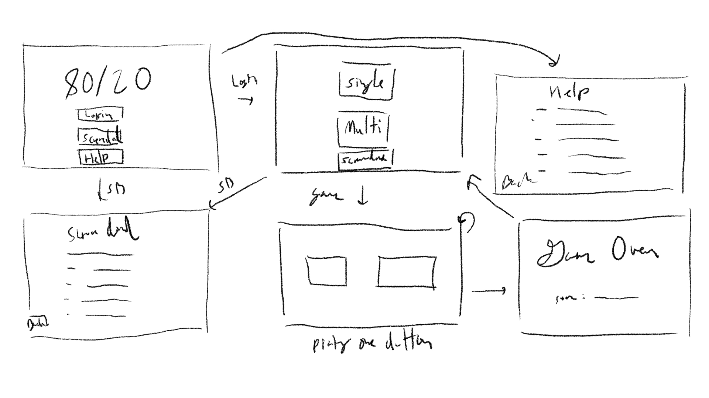
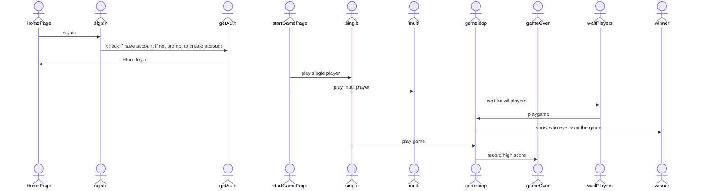

# Your startup name here

[My Notes](notes.md)

a website to host a 80/20 chanch game to play with your friends

> [!NOTE]
> This is a template for your startup application. You must modify this `README.md` file for each phase of your development. You only need to fill in the section for each deliverable when that deliverable is submitted in Canvas. Without completing the section for a deliverable, the TA will not know what to look for when grading your submission. Feel free to add additional information to each deliverable description, but make sure you at least have the list of rubric items and a description of what you did for each item.

> [!NOTE]
> If you are not familiar with Markdown then you should review the [documentation](https://docs.github.com/en/get-started/writing-on-github/getting-started-with-writing-and-formatting-on-github/basic-writing-and-formatting-syntax) before continuing.

### Elevator pitch

a 80/20 chance game to play with friends. IT will be hosted a website where their is a single player and mutiple player mode. in Single player their is a score board to complete for the highest score, for mutiple player you play with your freinds to complete to see who can last the longest. in single player their will also be rewards depending on how long you last.

### Design

Design image is a rough flow diagram of what the page flow and game loop will look like for the enduser.

### Key features

- mutiple player mode where mutple player (max 3) can player the 80/20 game.
- simgle player mode where you try to get the high score and get rewards when you get certain milezones.
- 80/20 game with two buttons. one button is rendomly choosen as the correct button while the other one is choose as the wrong one.
- score board for single player mode to see who has the highest score.
- will use apiNija to inject a random joke when the player losses the game.

### Technologies

I am going to use the required technologies in the following ways.

- **HTML** - use to structure the website and orgainze the elements
- **CSS** - added the design and look of the website
- **React** - routing to the different player modes
- **Service** - different endpoints to the different pages detmereing their functionality and the elements they should have. Also have an API to inject jokes when the player game overs
- **DB/Login** - used for scoreboard in single player mode
- **WebSocket** - mutiplePlay feature for the 80/20 game

## 🚀 Specification Deliverable

> [!NOTE]
> Fill in this sections as the submission artifact for this deliverable. You can refer to this [example](https://github.com/webprogramming260/startup-example/blob/main/README.md) for inspiration.

For this deliverable I did the following. I checked the box `[x]` and added a description for things I completed.

- [x] I completed the prerequisites for this deliverable (Git commit requirement)
- [x] Proper use of Markdown
- [x] A concise and compelling elevator pitch
- [x] Description of key features
- [x] Description of how you will use each technology including your 3rd party API and use of WebSocket
- [x] One or more rough sketches of your application. Images must be embedded in this file using Markdown image references.

## 🚀 AWS deliverable

For this deliverable I did the following. I checked the box `[x]` and added a description for things I completed.

- [x] **Rented EC2 server**
- [x] **Leased domain name**
- [x] **Server accessible** from my domain: [https://8020game.online](https://8020game.online)

## 🚀 HTML deliverable

For this deliverable I did the following. I checked the box `[x]` and added a description for things I completed.

- [x] I completed the prerequisites for this deliverable (Simon deployed, GitHub link, Git commits)
- [x] **HTML pages** - added what I think is all the HTML pages I will need for the project (index, login, signup, scoreBoard, playGameMulti, playGameSingle, modeSelection, help, and gameOver)
- [x] **Proper HTML element usage** - HTML ussage should be in place
- [x] **Links** - aded links to navigate between pages, they are next to the buttons because the buttons will eventually be what moves the user between pages
- [x] **Text** - their is some text in plaec around the website, but will be made more dynamic once we get their
- [x] **3rd party API placeholder** - place holder is in the game over screen where a joke will be placed
- [x] **Images** - the title 80/20 and the game over screen will have images, iii do nt have those made yet so they are jsut placeholders of what will be their
- [x] **Login placeholder** - login/signup html
- [x] **DB data placeholder** - in scoreboard and signup will also have it
- [x] **WebSocket placeholder** - will go in the playGameMulti.html file

## 🚀 CSS deliverable

For this deliverable I did the following. I checked the box `[x]` and added a description for things I completed.

- [ ] I completed the prerequisites for this deliverable (Simon deployed, GitHub link, Git commits)
- [ ] **Visually appealing colors and layout. No overflowing elements.** - I did not complete this part of the deliverable.
- [ ] **Use of a CSS framework** - I did not complete this part of the deliverable.
- [ ] **All visual elements styled using CSS** - I did not complete this part of the deliverable.
- [ ] **Responsive to window resizing using flexbox and/or grid display** - I did not complete this part of the deliverable.
- [ ] **Use of a imported font** - I did not complete this part of the deliverable.
- [ ] **Use of different types of selectors including element, class, ID, and pseudo selectors** - I did not complete this part of the deliverable.

## 🚀 React part 1: Routing deliverable

For this deliverable I did the following. I checked the box `[x]` and added a description for things I completed.

- [ ] I completed the prerequisites for this deliverable (Simon deployed, GitHub link, Git commits)
- [ ] **Bundled using Vite** - I did not complete this part of the deliverable.
- [ ] **Components** - I did not complete this part of the deliverable.
- [ ] **Router** - I did not complete this part of the deliverable.

## 🚀 React part 2: Reactivity deliverable

For this deliverable I did the following. I checked the box `[x]` and added a description for things I completed.

- [ ] I completed the prerequisites for this deliverable (Simon deployed, GitHub link, Git commits)
- [ ] **All functionality implemented or mocked out** - I did not complete this part of the deliverable.
- [ ] **Hooks** - I did not complete this part of the deliverable.

## 🚀 Service deliverable

For this deliverable I did the following. I checked the box `[x]` and added a description for things I completed.

- [ ] I completed the prerequisites for this deliverable (Simon deployed, GitHub link, Git commits)
- [ ] **Node.js/Express HTTP service** - I did not complete this part of the deliverable.
- [ ] **Static middleware for frontend** - I did not complete this part of the deliverable.
- [ ] **Calls to third party endpoints** - I did not complete this part of the deliverable.
- [ ] **Backend service endpoints** - I did not complete this part of the deliverable.
- [ ] **Frontend calls service endpoints** - I did not complete this part of the deliverable.
- [ ] **Supports registration, login, logout, and restricted endpoint** - I did not complete this part of the deliverable.
- [ ] **Uses BCrypt to hash passwords** - I did not complete this part of the deliverable.

## 🚀 DB deliverable

For this deliverable I did the following. I checked the box `[x]` and added a description for things I completed.

- [ ] I completed the prerequisites for this deliverable (Simon deployed, GitHub link, Git commits)
- [ ] **Stores data in MongoDB** - I did not complete this part of the deliverable.
- [ ] **Stores credentials in MongoDB** - I did not complete this part of the deliverable.

## 🚀 WebSocket deliverable

For this deliverable I did the following. I checked the box `[x]` and added a description for things I completed.

- [ ] I completed the prerequisites for this deliverable (Simon deployed, GitHub link, Git commits)
- [ ] **Backend listens for WebSocket connection** - I did not complete this part of the deliverable.
- [ ] **Frontend makes WebSocket connection** - I did not complete this part of the deliverable.
- [ ] **Data sent over WebSocket connection** - I did not complete this part of the deliverable.
- [ ] **WebSocket data displayed** - I did not complete this part of the deliverable.
- [ ] **Application is fully functional** - I did not complete this part of the deliverable.
